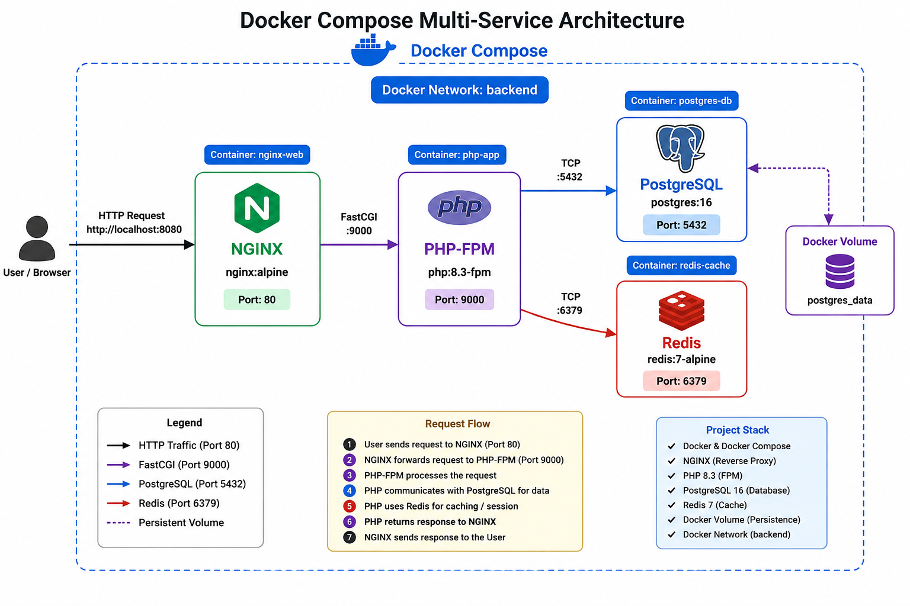
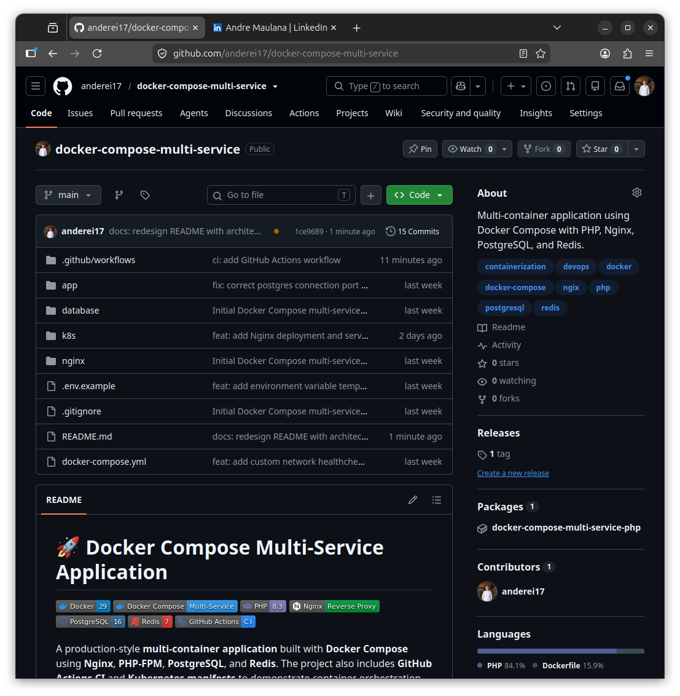
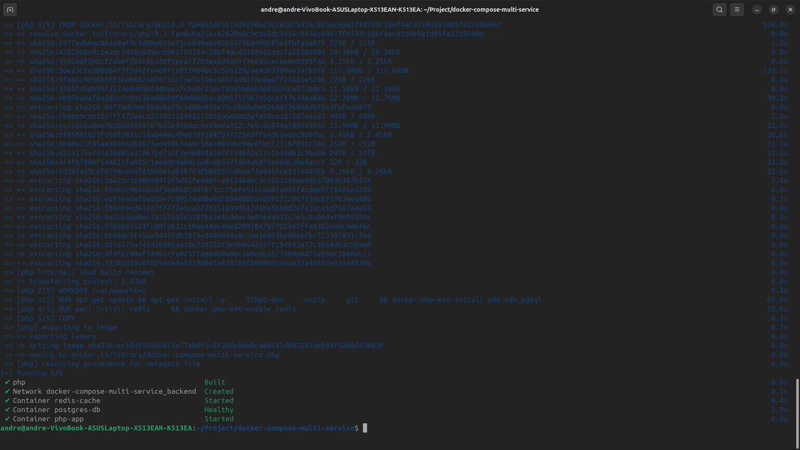
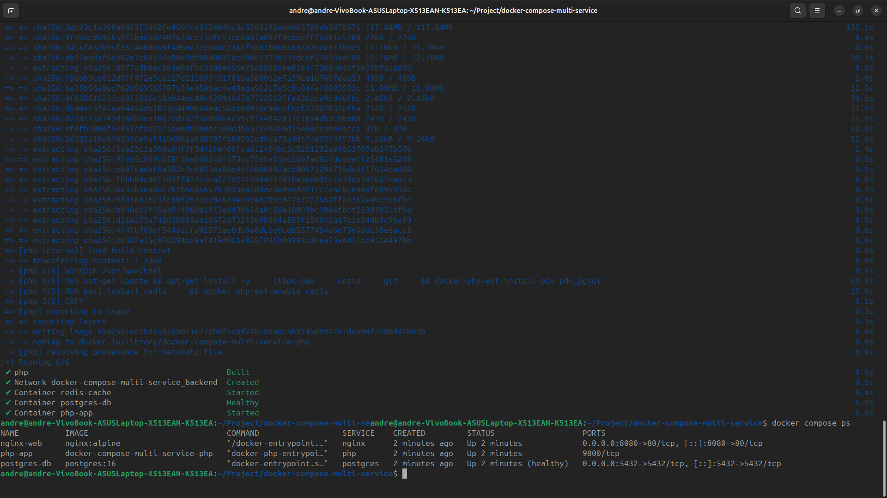
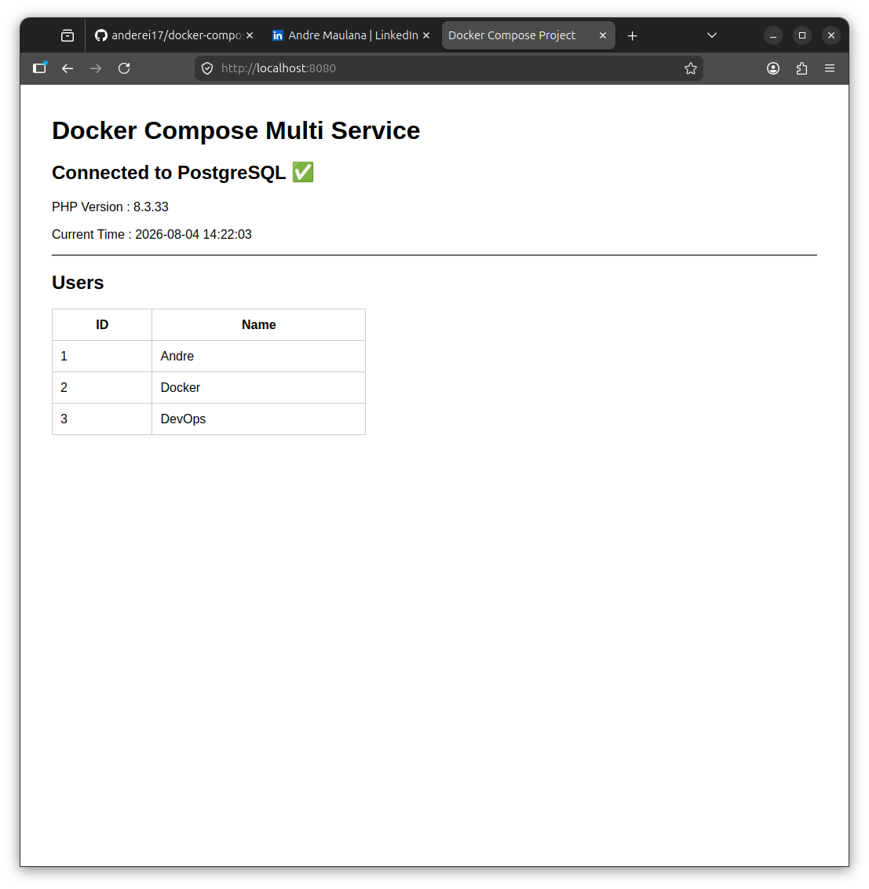
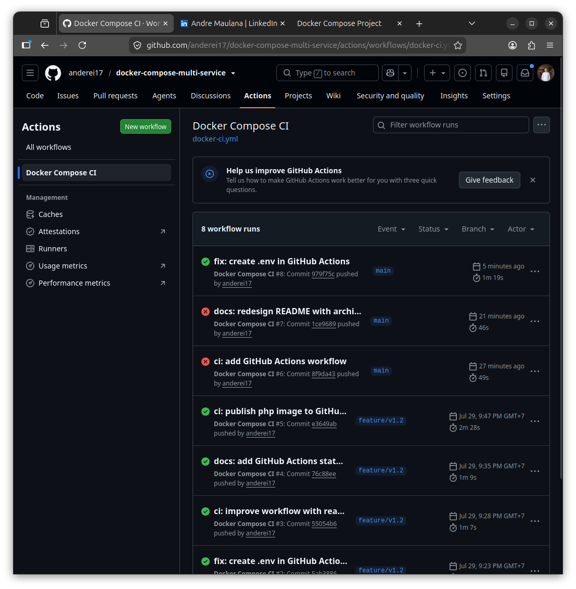
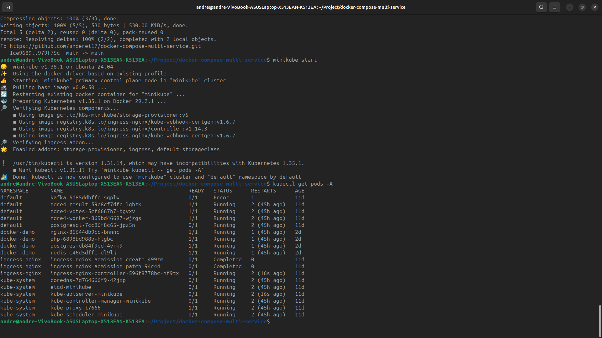
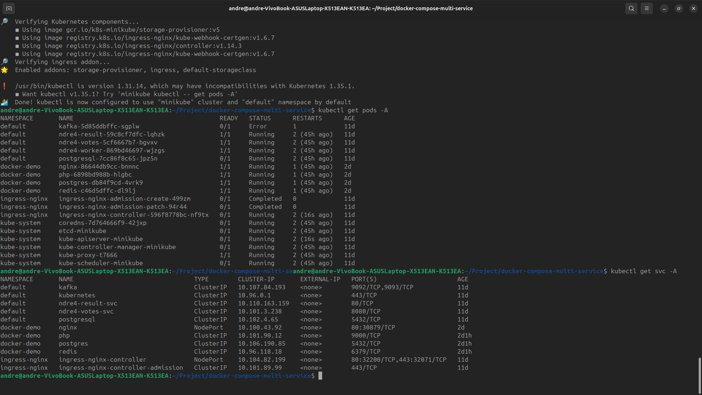

# 🚀 Docker Compose Multi-Service Application


A production-style **multi-container application** built with **Docker Compose** using **Nginx**, **PHP-FPM**, **PostgreSQL**, and **Redis**. The project also includes **GitHub Actions CI** and **Kubernetes manifests** to demonstrate container orchestration and deployment concepts.

---

# 📖 Project Overview

This project demonstrates how multiple containers communicate using Docker Compose.

The application consists of:

- Nginx Reverse Proxy
- PHP-FPM Application
- PostgreSQL Database
- Redis Cache
- Docker Compose Networking
- GitHub Actions CI Pipeline
- Kubernetes Deployment Manifests

---

# 🏗 Architecture



---

# 🔀 Service Flow

```text
                User
                  │
                  ▼
           localhost:8080
                  │
                  ▼
               Nginx
                  │
        ┌─────────┴─────────┐
        ▼                   ▼
    PHP-FPM             Redis Cache
        │
        ▼
   PostgreSQL
```

---

# 🛠 Tech Stack

- Docker
- Docker Compose
- PHP 8.3
- Nginx
- PostgreSQL 16
- Redis 7
- GitHub Actions
- Kubernetes

---

# 📦 Services

| Service | Description |
|----------|-------------|
| Nginx | Reverse Proxy & Web Server |
| PHP-FPM | PHP Application |
| PostgreSQL | Relational Database |
| Redis | In-memory Cache |
| Docker Compose | Container Orchestration |

---

# 📂 Project Structure

```text
docker-compose-multi-service/
│
├── app/
│   ├── Dockerfile
│   └── index.php
│
├── database/
│   └── init.sql
│
├── nginx/
│   └── default.conf
│
├── redis/
│
├── k8s/
│   ├── namespace.yaml
│   ├── configmap.yaml
│   ├── secret.yaml
│   ├── nginx.yaml
│   ├── php.yaml
│   ├── postgres.yaml
│   └── redis.yaml
│
├── screenshots/
│   ├── architecture.png
│   ├── 01-github-repository.png
│   ├── 02-docker-compose-up.png
│   ├── 03-docker-ps.png
│   ├── 04-web-app.png
│   ├── 05-github-actions.png
│   ├── 06-kubectl-get-pods.png
│   └── 07-kubectl-get-services.png
│
├── .github/
│   └── workflows/
│       └── docker-ci.yml
│
├── docker-compose.yml
├── README.md
└── .gitignore
```

---

# ⚙ Prerequisites

- Docker
- Docker Compose
- Git

---

# 🚀 Getting Started

Clone the repository

```bash
git clone https://github.com/anderei17/docker-compose-multi-service.git

cd docker-compose-multi-service
```

Build and start the application

```bash
docker compose up --build -d
```

Verify running containers

```bash
docker compose ps
```

Stop all containers

```bash
docker compose down
```

---

# 🌐 Access

| Service | URL |
|----------|-----|
| Web Application | http://localhost:8080 |

---

# 📸 Screenshots

## GitHub Repository



---

## Docker Compose Build & Up



---

## Running Containers



---

## Running Application



---

## GitHub Actions Workflow



---

## Kubernetes Pods



---

## Kubernetes Services



---

# 🔄 GitHub Actions

The GitHub Actions workflow automatically:

- Checkout repository
- Build Docker image
- Start containers
- Verify application
- Stop containers

Workflow location:

```text
.github/workflows/docker-ci.yml
```

---

# ☸ Kubernetes

This repository also includes Kubernetes manifests for deploying the application.

Available resources:

- Namespace
- ConfigMap
- Secret
- Nginx Deployment
- PHP Deployment
- PostgreSQL Deployment
- Redis Deployment

Manifest location:

```text
k8s/
```

---

# 🧪 Verification

Verify running containers

```bash
docker compose ps
```

Verify application

```bash
curl http://localhost:8080
```

Expected output:

```text
Connected to PostgreSQL ✅
Connected to Redis ✅
PHP Version 8.3
```

---

# 🚀 Future Improvements

- Docker Hub Integration
- Jenkins CI/CD Pipeline
- Multi-stage Docker Build
- GitHub Webhooks
- Helm Charts
- Kubernetes Ingress
- Prometheus & Grafana Monitoring
- Centralized Logging
- SSL with Let's Encrypt
- ArgoCD GitOps Deployment

---

# 👨‍💻 Author

**Andre Maulana**

GitHub

https://github.com/anderei17

LinkedIn

https://www.linkedin.com/in/andre-maulana-865179217/

---

If you found this project useful, consider giving it a ⭐ on GitHub.
